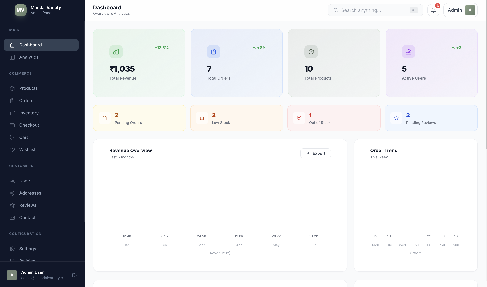
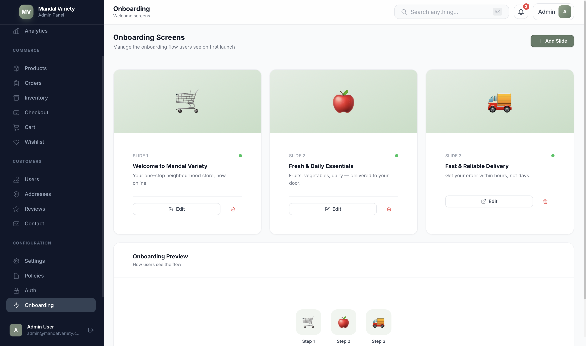
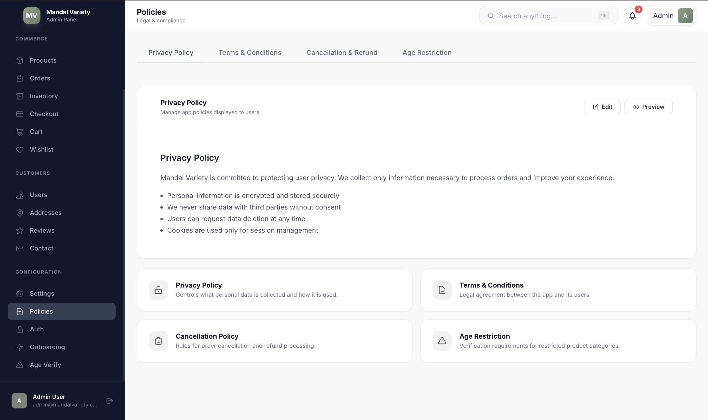

<p align="center">
  
  <br/>
  
  
  
  
</p>

# Mandal Variety — Admin Panel

A premium, SaaS-style admin dashboard for the **Mandal Variety** ecommerce app. Built with **Tailwind CSS**, **Bootstrap Grid**, and **vanilla JavaScript (ES Modules)** — no frameworks, no build step, zero dependencies to install.

> Designed to feel like Shopify Admin / Stripe Dashboard — clean, modern, and production-grade.

---

## Screenshots

| Dashboard | Onboarding | Policies |
|:---------:|:----------:|:--------:|
|  |  |  |

---

## Features

### Core Modules
- **Dashboard** — KPI cards (revenue, orders, products, users), alert banners, revenue & order trend charts, recent orders, activity feed, low-stock alerts
- **Products** — Full CRUD with modal forms, table/grid view toggle, category filter tabs, delete confirmation
- **Orders** — Status filter tabs, KPI row, inline status dropdown, detailed order sub-view
- **Users** — Customer management, block/unblock, user detail modal with order history
- **Inventory** — Stock KPIs, low-stock & out-of-stock panels, restock modal
- **Analytics** — Revenue & AOV charts, category sales breakdown, payment methods, top products

### Customer Features
- **Reviews** — Rating KPIs, filter by status (pending/approved/flagged), approve & flag actions
- **Addresses** — Full CRUD with modal form, user-linked delivery addresses
- **Wishlist** — Saved items overview with stock status, remove action
- **Cart** — Active shopping cart monitoring with item-level detail
- **Contact** — Customer messages table with resolve action, store contact info cards

### Configuration
- **Settings** — Tabbed config (General, Payment, Notifications, Delivery) with toggle switches
- **Policies** — Tabbed viewer/editor for Privacy Policy, Terms & Conditions, Cancellation & Refund, Age Restriction
- **Auth** — Authentication method toggles (Email, OTP, Google), auth flow overview
- **Onboarding** — Welcome screen slide management with live preview
- **Age Verification** — Tobacco compliance settings, restricted product table, verification log
- **Checkout** — Transaction KPIs and payment history table

### UI/UX
- Responsive layout with collapsible sidebar (mobile-friendly)
- Dark sidebar with grouped navigation (Main, Commerce, Customers, Configuration)
- Sticky header with global search (`⌘K`), notifications, profile dropdown
- Modal system, toast notifications, skeleton loaders
- Smooth animations (fade-in, slide-up) and micro-interactions
- 30+ inline SVG icons — no icon library dependency
- Print-optimized styles

---

## Tech Stack

| Layer | Technology |
|-------|-----------|
| **Styling** | [Tailwind CSS](https://tailwindcss.com/) (CDN) with custom brand theme |
| **Grid** | [Bootstrap 5.3](https://getbootstrap.com/) (grid-only CSS) |
| **Typography** | [Inter](https://rsms.me/inter/) via Google Fonts |
| **JavaScript** | Vanilla ES Modules (`import`/`export`) |
| **State** | Custom reactive pub/sub store |
| **Routing** | Hash-based SPA router |
| **Icons** | Inline SVG library (30+ icons) |
| **Build** | None — open `index.html` and go |

---

## Project Structure

```
admin/
├── index.html                          # Main HTML shell
├── assets/
│   ├── css/
│   │   └── custom.css                  # Scrollbar, animations, toggles, print styles
│   ├── js/
│   │   ├── app.js                      # Bootstrap: init store, sidebar, router, shortcuts
│   │   ├── components/
│   │   │   └── ui.js                   # Reusable components (cards, tables, modals, toasts…)
│   │   ├── models/
│   │   │   └── seedData.js             # Static seed data for all modules
│   │   ├── utils/
│   │   │   ├── dom.js                  # DOM helpers (h, $, mount, currency, formatDate…)
│   │   │   ├── icons.js                # SVG icon library
│   │   │   ├── router.js               # Hash-based SPA router
│   │   │   └── store.js                # Reactive state store (pub/sub + CRUD helpers)
│   │   └── views/
│   │       ├── dashboard.js            # Dashboard view
│   │       ├── products.js             # Products CRUD
│   │       ├── orders.js               # Orders management
│   │       ├── users.js                # User management
│   │       ├── inventory.js            # Stock management
│   │       ├── analytics.js            # Charts & insights
│   │       ├── reviews.js              # Customer reviews
│   │       ├── addresses.js            # Delivery addresses
│   │       ├── wishlist.js             # Wishlist items
│   │       ├── cart.js                 # Active carts
│   │       ├── checkout.js             # Checkout transactions
│   │       ├── policies.js             # Legal policies viewer
│   │       ├── settings.js             # Store settings
│   │       ├── auth.js                 # Auth configuration
│   │       ├── onboarding.js           # Onboarding slides
│   │       ├── contact.js              # Contact & messages
│   │       └── tobacco.js              # Age verification
│   └── screenshots/
│       ├── dashboard.png
│       ├── onboarding.png
│       └── policies.png
```

---

## Getting Started

### Prerequisites

Any static file server — or just a browser. No `npm install`, no build tools.

### Run Locally

```bash
# Clone the repository
git clone https://github.com/your-username/ecommerce_project_admin.git
cd ecommerce_project_admin

# Serve with Python (built-in)
python3 -m http.server 5177 --directory admin

# Or use any static server
npx serve admin -p 5177
```

Open **http://localhost:5177** in your browser.

> **Note:** A local server is required because the project uses ES Modules (`import`/`export`), which browsers block when opened via `file://`.

---

## Architecture

```
┌─────────────┐     ┌──────────┐     ┌──────────────┐
│  index.html │────▶│  app.js  │────▶│   Router     │
│  (shell)    │     │ (boot)   │     │ (hash-based) │
└─────────────┘     └────┬─────┘     └──────┬───────┘
                         │                   │
                    ┌────▼─────┐        ┌────▼───────┐
                    │  Store   │◀──────▶│   Views    │
                    │ (state)  │        │ (17 pages) │
                    └────┬─────┘        └────┬───────┘
                         │                   │
                    ┌────▼─────┐        ┌────▼───────┐
                    │ Seed Data│        │ Components │
                    │ (models) │        │   (ui.js)  │
                    └──────────┘        └────────────┘
```

- **Store** — Centralized reactive state with `subscribe()`, `setState()`, and CRUD helpers (`addItem`, `updateItem`, `removeItem`). Views subscribe to state keys and re-render on change.
- **Router** — Listens to `hashchange`, maps routes to view render functions, and fires a `beforeRoute` hook for updating the header title and active nav highlight.
- **Views** — Each view is an isolated ES module exporting a single `render*(root)` function that builds its UI using the shared component library.
- **Components** — `ui.js` provides reusable primitives: `metricCard`, `dataTable`, `panel`, `btn`, `badge`, `openModal`, `toast`, `tabs`, `toggle`, `formField`, etc.

---

## Customization

### Brand Colors

Edit the Tailwind config in `index.html`:

```js
colors: {
  brand: {
    50:  '#f0f5f0',
    500: '#647a67',   // Primary green
    900: '#141814',
  },
  sb: {
    DEFAULT: '#0f172a', // Sidebar background
  },
}
```

### Adding a New View

1. Create `admin/assets/js/views/myview.js`:
   ```js
   import { h, mount } from '../utils/dom.js';
   import { panel } from '../components/ui.js';

   export function renderMyView(root) {
     mount(root, panel({ title: 'My View' },
       h('p', {}, 'Hello world')
     ));
   }
   ```
2. Add the route in `app.js` → `ROUTES` object
3. Add the nav item in `app.js` → `NAV_SECTIONS`
4. Add page meta in `app.js` → `ROUTE_META`

---

## Browser Support

| Browser | Version |
|---------|---------|
| Chrome  | 80+     |
| Firefox | 78+     |
| Safari  | 14+     |
| Edge    | 80+     |

Requires ES Module support (`<script type="module">`).

---

## License

This project is proprietary to **Mandal Variety**. All rights reserved.
